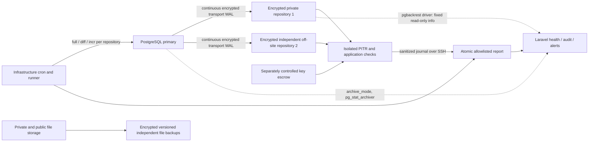

# Backup and recovery architecture

Implementation status: **CONDITIONAL**. Deployment/recovery readiness: **NOT_READY**.
No production backup, restore, WAL change, key rotation or repository deletion was performed.

## Evidence from inspection (2026-09-27)

- Installed Laravel 12.69.2; `composer.json` requires Laravel 12 / PHP 8.2.
- Local connection is PostgreSQL 18.6, `wal_level=replica`, `archive_mode=off`.
  An archive command is configured but cannot archive while archive mode is off.
  These are local observations, not evidence of production server configuration.
- Local queue uses the database; cache and sessions use files. Redis is supported but
  not active locally. Multi-server deployment needs shared cache for monitoring locks.
- Existing runbook describes Linux, PHP-FPM, supervised workers and cron. No tracked
  Docker/Compose, Kubernetes, infrastructure provisioning or CI/CD deployment exists.
- File disks: private `storage/app/private`, public `storage/app/public`; many services
  explicitly select these disks. An S3 disk template exists but no local bucket/key
  configuration was detected. No cloud vendor or approved object store is established.
- Existing DR document described `pg_dump`, unspecified off-site storage, sample GPG
  recipient and unapproved 1h/4h objectives. These are superseded, not deployed evidence.
- No pgBackRest executable, configured repository, recoverable physical backup or
  restore-test evidence was available here: **INFRASTRUCTURE_NOT_AVAILABLE**.
- `/up` tests database/cache connectivity. It remains a liveness/readiness probe;
  backup failure must not remove healthy web servers from a load balancer.

## Chosen design

pgBackRest on the documented Linux infrastructure is the primary physical recovery
tool. It covers full/differential/incremental backups, archive retrieval and PITR.
Windows development machines do not host pgBackRest or production DR. There the application
reports NOT_CONFIGURED (integration off) or COMMAND_NOT_FOUND (integration on, no binary) instead
of failing; see [Status integration](#status-integration). No WSL or Docker platform is assumed.
Confirm the real production OS, PostgreSQL major, extensions and supported pgBackRest
release (with `verify`) before deployment. No Laravel dump package was added.



Two repository hosts are a deployable template, not a claim that these hosts exist.
Both need independent physical/failure domains, and repository 2 must be off-site or
isolated as approved. Two directories on the primary do not qualify. Production plus
two backup locations supports the three-copy goal; two media types and actual 3-2-1
compliance require inventory and signed evidence. Replication/standby supports
availability; it propagates deletions and is not a backup.

## Scheduling and retention

Infrastructure cron drives backups even when Laravel, queues or the application DB
are unavailable. `deploy/backup/crontab.example` contains adjustable example times,
weekly full and daily differential backups **for each repository**, five-minute status
collection and weekly verification. `incr` is a supported substitute where approved.
The isolated runner has a monthly PITR test per repository; also test after key,
schema, backup or infrastructure changes. Choose windows from measured runtimes.

Proposed baseline: 12 retained weekly full chains and their dependent daily backups
and WAL. This is a count, not a guarantee of 84 calendar days; missed fulls/manual fulls
change the window. Alert on full freshness. Keep default archive retention tied to
full chains. Do not independently delete WAL or apply shorter object-store lifecycles.
`expire` is separately scheduled and audited after review; automatic expiry is disabled
in the template. Configure the same full count in Laravel for visibility; app metadata
does not change pgBackRest policy. None of these periods is a legal mandate.
Government retention/legal holds require a separately approved policy.

Optional supplementary logical archive: `backup.py logical` runs `pg_dump --format=custom`
through a dedicated read-only service role, pipes it into an operator-configured public-key
encryptor (fixed argument vector; the decryption key is escrowed elsewhere, never on the host)
and writes a mode-0600 file into a private, independent `output_dir`. It keeps
`retain_count` archives (proposed 12 monthly) and prunes only its own
`euisis-YYYYMMDD-HHMMSS.dump.enc` names, never pgBackRest repository content. It is journaled
as LOGICAL_BACKUP with no repository. With `BACKUP_LOGICAL_ENABLED=true`, a missing, stale or
failed logical archive is a WARNING. It is never CRITICAL and never a substitute for
pgBackRest/PITR evidence. It is disabled by default until deployed.

## Trust and security boundaries

- Only infrastructure accounts can change backups, repositories or keys. The application
  never runs a shell, backup, expire, restore or stanza-create, and cannot upload reports,
  download dumps, delete backup files or edit infrastructure secrets. With the `pgbackrest`
  driver it runs exactly `version` and `--stanza=<configured> --output=json info` (and `check`
  only from the operator CLI) as fixed argument vectors, preferably through `sudo -n -u
  <backup account>` and an exact sudoers rule so PHP never reads the pgBackRest configuration
  or cipher keys. With the `report` driver it only reads the ops-published report.
- Use repository encryption with separately escrowed keys and SSH with pinned host
  keys, or an approved private object store with validated TLS. Never disable TLS checks.
- Repo directories are mode 0700/0750, outside web roots, never world-readable. Use
  separate backup accounts and restrictive SSH commands/access where supported. The
  application DB role is not a backup superuser.
- The status directory and all parents are owned by operations, not PHP; grant PHP
  traversal/read of **only status.json**, not the journal, configuration, logs or secrets.
  Move reports between hosts over authenticated SSH into a staging directory, then
  atomically rename; do not accept browser uploads. A fresh timestamp is not authenticity:
  directory ownership and the authenticated transport are the trust root.
- Root-owned `controls.json` is an evidence attestation, not an automatic infrastructure
  discovery result. Set a control true only after recording proof in a restricted ticket.
  `checked_at` expires with the restore-test threshold. Never set all true just to pass.
- Protect the runner, cron, configuration and journal from the web account. The CLI
  recovery recording command trusts the OS operator to name their application account;
  it is not an independent OS authentication mechanism. Restrict shell/sudo and retain
  OS session audit externally. Copy sanitized audit externally so a DB rollback cannot
  erase incident evidence. No emergency self-approval bypass exists, even for Super Admin.
- Backups and restore sandboxes contain HR data. No casual developer access or production
  snapshots on unmanaged laptops. Consider offline/WORM/object lock with a separately
  controlled deletion identity; no immutability capability is claimed deployed.

## Status integration

**Incident (2026-09-27).** The page showed "INFRASTRUCTURE NOT AVAILABLE OR INVALID REPORT".
`BACKUP_STATUS_ENABLED` was unset, so `BackupReportReader` threw `INFRASTRUCTURE_NOT_AVAILABLE`.
A `catch (Throwable)` in `BackupStatusService::status()` then replaced every failure (disabled,
missing file, unreadable, invalid JSON, schema error, even a code bug) with one generic issue
code, which the page printed with underscores removed. Underneath, this Windows development
host has no pgBackRest (not on PATH, no WSL distribution, no Docker) and no report file.
Local PostgreSQL 18.6 is reachable with `archive_mode=off` and nothing archived. The report
parser was never reached, so it was not a parser bug.

The status is now built in layers (`app/Services/Backup`):

| Layer | Source | Notes |
|---|---|---|
| `BackupInfrastructureAdapter` | `DisabledBackupAdapter`, `PgBackRestBackupAdapter`, `ReportBackupAdapter` | Selected by `BACKUP_STATUS_ENABLED` and `BACKUP_DRIVER`. |
| `PgBackRestInfoParser` | `info --output=json` (pgBackRest 2.33+) | Validates shape before indexing; unknown formats fail closed. |
| `WalArchiveInspector` | `archive_mode`, `pg_stat_archiver` on the app's own connection | Backlog only with pg_monitor or an EXECUTE grant. |
| `BackupEvidenceReader` | runner report journal, attestations, capacity | Optional; absent evidence reads "not recorded", never "passed". |
| `BackupHealthEvaluator` | all of the above plus policy | Pure rules producing the `BackupHealthStatus` DTO. |

The DTO carries `overall_status`, `infrastructure_status`, `repository_status`, `backup_status`,
`wal_status`, `verification_status`, `restore_test_status`, `reason_code`, `message`,
`latest_*` timestamps, `backup_age_seconds`, `readiness`, `production_blocker`, `environment`
and `checked_at`. Reason codes are specific: NOT_CONFIGURED, COMMAND_NOT_FOUND,
CONFIG_NOT_FOUND, INVALID_CONFIGURATION, PERMISSION_DENIED, COMMAND_TIMEOUT, COMMAND_FAILED,
INVALID_COMMAND_OUTPUT, STANZA_NOT_FOUND, REPOSITORY_UNAVAILABLE, BACKUP_NOT_FOUND,
WAL_ARCHIVE_UNHEALTHY, the REPORT_* codes and others. Each has a meaning, a check and a safe
remediation in the [troubleshooting runbook](runbooks/backup-health-troubleshooting.md).

Rules:

- **Environment.** Production (or `BACKUP_ENFORCE_PRODUCTION_RULES=true`, or
  `production:readiness --strict`) turns missing or unreachable infrastructure into CRITICAL
  with `production_blocker=true`. Elsewhere the overall status is NOT_CONFIGURED,
  INFRASTRUCTURE_UNAVAILABLE or UNKNOWN (timeout), with `production_blocker=false`. None of these
  is ever HEALTHY.
- **HEALTHY** requires the tool to answer and both repositories to be reachable with a recent
  valid backup. WAL archiving must be healthy (when `BACKUP_PITR_REQUIRED`), and verification
  and restore tests must have passed within policy.
- **CRITICAL** covers: no valid backup, repository or stanza unavailable, errored backups,
  backups older than `BACKUP_CRITICAL_HOURS`, broken WAL where PITR is required, a failed
  verification or restore test, and a failed scheduled operation.
- **WARNING** covers: backups older than `BACKUP_STALE_HOURS`, a stale full backup, overdue or
  unrecorded verification or restore tests, capacity above threshold, an unencrypted repository,
  WAL lag, unknown WAL, and a failed or stale logical archive.
- **READINESS** issues (unverified attestations, RPO/RTO undecided, no alert recipients, unknown
  capacity) leave operational health unchanged but keep `readiness=NOT_READY`, which is a
  production blocker.
- **Probing.** Probes are cached for `BACKUP_STATUS_CACHE_SECONDS` (default 60, at most 300);
  thresholds and history are re-evaluated on every call. The page's Refresh button (rate
  limited) and every CLI run probe afresh.
- **Commands.** Each runs under an explicit timeout (`PGBACKREST_TIMEOUT_SECONDS`, default 20),
  with a scrubbed environment and forced console logging off. The scrubbed environment drops
  APP_KEY, DB credentials and PGBACKREST_* variables, which pgBackRest would read as options.
  Forcing console logging off keeps stdout pure JSON.
- **Logging.** Fresh CRITICAL/UNKNOWN/unavailable results log `backup.health.failed` with
  overall status, reason code, component, exit code, environment and time only.

## Application visibility and operations

System → Backup & Recovery shows separate Infrastructure, Repository, Latest Backup, WAL/PITR,
Verification and Restore Test cards. It also shows environment, reason, production-blocker
flag, per-repository details, prioritized issues and policy. The authorized dashboard card
summarizes the same data. Archive min/max names are not continuity proof; a requested target
still requires isolated PITR. Idle clusters can exceed the archive lag threshold: investigate
workload and `archive_timeout` rather than suppressing that warning.

`backup:health` probes afresh and prints the environment, integration and driver, binary,
stanza, each component with its reason, the overall status, reason code, message, readiness,
production blocker and issues. Options:

- `-v` adds sanitized diagnostics: platform, run-as, config presence, command, exit code,
  output presence, pgBackRest error number and parser result.
- `--json` prints the full document.
- `--check` also runs `pgbackrest check` for operators. It archives a WAL segment.

`backup:list [--repo=1|2]` prints only backup labels, types, completion times and sizes.
`backup:health --monitor` imports an idempotent bounded
operation history, writes typed audit events and sends database notifications and optional
mail to configured active accounts with BOTH `backups.view_status` and `backups.view_logs`.
It emits `BackupHealthAlert` for existing external integrations. Notifications use Laravel's
existing channels. Repeats are throttled; a changed failure set alerts immediately.
Use an independent infrastructure dead-man monitor for failed/missing cron, backup,
collector, journal transfer, alert delivery, WAL growth and repository capacity when the
application/database is down. No Prometheus deployment was found; no public metrics endpoint
was introduced. Internal health JSON contains backup ages, timestamps, failures and usage.

The collector keeps the latest 1,000 journal entries in each report. Preserve full journal
history in restricted operations storage; import at least every five minutes. Never prune
unimported events. A missed terminal event or dead runner is caught by freshness/stuck checks.
The journal remains outside PostgreSQL and is still usable during application outages.

Permission defaults: System Admin and Super Admin receive backup permissions. City Admin,
Bureau Admin and Organizational Admin do not. Assign a limited custom operations/security
role for viewing/history/alerts and separate recovery requester/reviewer/approver accounts.
`backups.run` permits CLI recording, not a browser backup/restore. `backups.verify` and
`backups.manage_policy` express oversight; infrastructure execution and policy edits remain
OS-controlled. `backups.view_history` gates full operation history. All page reads are audited
and routes are rate limited under the existing verified/MFA/admin middleware.

Restore workflow. A request records the type (POINT_IN_TIME with an explicit-offset target,
BACKUP_SET with a validated pgBackRest label, or LATEST consistent point), the incident ticket
and a reason:

```
REQUESTED → UNDER_REVIEW → APPROVED → TEST_RESTORE_RUNNING → TEST_RESTORE_VERIFIED
   (review)   (approve:     (CLI test-start)  (CLI test-pass,       │
              ≠ requester)                    validation evidence)  ▼
                            PRODUCTION_RESTORE_AUTHORIZED (authorize-production: ≠ requester)
                                   → RESTORING (CLI start, pre-restore safeguard evidence)
                                   → COMPLETED (CLI complete, integrity/smoke evidence) | FAILED (CLI fail)
```

TEST_RESTORE_RUNNING can end FAILED (CLI test-fail). Approvers can REJECT a request that is
REQUESTED, UNDER_REVIEW, APPROVED or TEST_RESTORE_VERIFIED. Requesters can CANCEL their own
open request, and approvers can cancel any open request up to PRODUCTION_RESTORE_AUTHORIZED.
Nothing can be cancelled once RESTORING has started. The browser can only request, review,
approve, authorize, reject and cancel. `backup:restore-record` records the operator's external
steps and executes no recovery commands. `started_at` is set when the isolated test starts, and
`completed_at` on COMPLETED/FAILED. Request type, target, label, incident and reason are
immutable. All transitions are transactional, row-locked and audited. Failure strings are
fixed codes, not raw stderr.

Audit events: BACKUP_STARTED/COMPLETED/FAILED, BACKUP_VERIFICATION_STARTED,
BACKUP_VERIFIED/VERIFICATION_FAILED, RESTORE_TEST_STARTED/PASSED/FAILED,
RESTORE_REQUESTED/REVIEWED/APPROVED/REJECTED/CANCELLED, PRODUCTION_RESTORE_AUTHORIZED,
PRODUCTION_RESTORE_STARTED/COMPLETED/FAILED, RETENTION_CLEANUP and BACKUP_STATUS_VIEWED.
Request-linked isolated tests reuse RESTORE_TEST_STARTED/PASSED/FAILED with the request as the
audited subject. Automated monthly tests use the operation record as the subject.

## Objectives and readiness

RPO and RTO: **NEEDS_DECISION**. Record approved values, approver and date in the operations
register, then configure BACKUP_RPO/BACKUP_RTO. Measure archive lag, backup cadence, file
snapshot cadence, restore duration, key retrieval and validation time before recommending
targets. The old 1-hour/4-hour document did not establish business approval.

`production:readiness --strict` blocks on unready backup evidence. READY requires fresh
success/verification/PITR evidence for both repositories, healthy WAL/database/capacity,
current independent/encrypted/private storage attestations, key/file recovery, retention
configuration, operational ownership, configured alert recipients, tested alerts/runbooks
and configured objectives. This code cannot prove that
an operator's attestation is true; the signed deployment checklist is still required.

Remaining infrastructure gates: actual hosts and failure domains, installation/version
compatibility, secret provisioning, WAL restart, both schedules, independent file snapshots,
capacity agents, secure report/journal transport, external alerts, isolated test runner,
recovered keys/files and full UI/login smoke testing. No deployment or actual restore was
possible in the provided Windows environment. Do not mark production READY based on unit tests.

## References and runbooks

Design cross-checked against the [pgBackRest command reference](https://pgbackrest.org/command.html),
[pgBackRest user guide](https://pgbackrest.org/user-guide.html) and
[PostgreSQL continuous archiving documentation](https://www.postgresql.org/docs/18/continuous-archiving.html).
The installed tool version must be pinned and exercised on staging; templates are not
universal provisioning scripts.

- [Backup operations](runbooks/database-backup.md)
- [Backup health troubleshooting](runbooks/backup-health-troubleshooting.md)
- [PITR](runbooks/postgresql-pitr.md)
- [Disaster recovery](runbooks/disaster-recovery.md)
- [File/object recovery](runbooks/object-storage-recovery.md)
- [Key recovery](key-recovery-runbook.md)
- [Restore validation](runbooks/restore-validation.md)
- [Go-live evidence](go-live-checklist.md)
