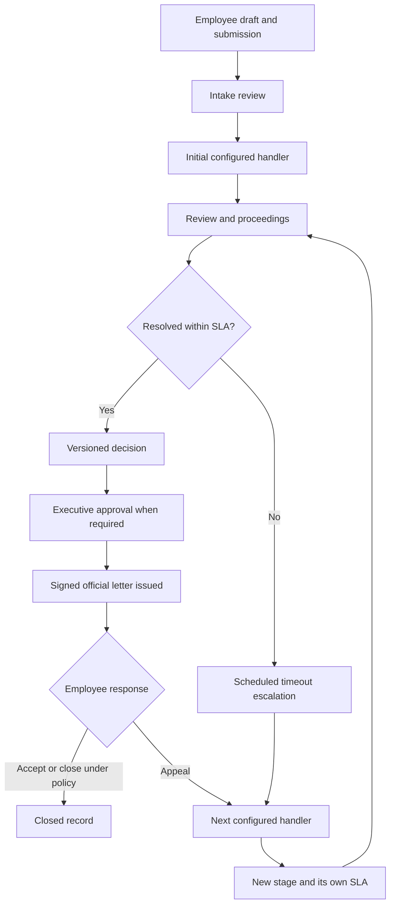

# Grievance Management architecture

This module lives inside EUISIS. Its HTTP boundary is `routes/grievances.php`, its workflow services are in `app/Services/Grievances`, and its staff and employee pages are under `resources/js/Pages/Grievances`. It reuses Organization, OrganizationUnit, EmployeeAssignment, Position, User, organization scope, RBAC, code rules, the working-day calendar, notifications, audit logs, and private file storage.

## Domain and ownership

| Aggregate | Responsibility |
| --- | --- |
| Grievance | Employee origin, stable reference, case status, current stage, confidentiality, closure and retention |
| GrievanceCommittee / CommitteeMember | Selected employee panel, effective terms, chair/writer/member roles |
| GrievanceCaseStage / StageMember / CaseOfficer | Handling episode, membership snapshot, assigned officers, movement and SLA snapshot |
| GrievanceRoute / SlaProfile / ApprovalRule | Effective routing, deadline and approval configuration |
| Evidence / EvidenceCustody | Private attachments, checksums, versions and custody events |
| Hearing / HearingParticipant / Minutes | Proceedings, participants and recorded minutes |
| Decision / DecisionVote / DecisionApproval | Versioned findings, voting and approval history |
| Letter / Recipient / Attachment / Dispatch | Official output, references, signature/seal metadata and delivery records |
| CaseEvent / Note / Task / Recusal | Audience-filtered timeline, internal work and conflicts |

Permanent teams and directorates remain organization units; they are not duplicated as grievance committee masters. `GrievanceHandlerRegistry` resolves their current employee placements and handler availability. `GrievanceCaseAccessService` combines permission checks with the user's actual case relationship.

## Business flow

The number of levels is configuration, not a fixed chain. A decision is not issued merely because it is finalized: issuing its official decision letter advances the decision and case and starts any configured appeal window.

## Migration and preservation

The four `2026_09_28_100000` through `100300` migrations expand the schema, backfill the first-generation module, add permissions and seed editable defaults. Legacy assignment, response and decision-letter tables are retained. Backfilled decisions and letters carry legacy identifiers. Case references are preserved; status remapping records `legacy_status` in metadata. Committee secretary roles become writer roles.

Rollback is not a substitute for a backup. The backfill rollback cannot perfectly invert merged statuses, and its writer-to-secretary conversion is broad. The defaults migration intentionally leaves configuration on rollback. Test upgrades on a restored PostgreSQL copy containing actual legacy cases and verify counts, identifiers, current stages, files and permissions before deployment.

`migrate --pretend` executes PHP migration code; permission synchronization and cache clearing are not a pure SQL listing. Use an isolated database and cache. Empty-database pretend can fail because later permission migrations expect rows that pretend did not insert. A successful SQLite fresh test run also does not prove PostgreSQL upgrade correctness or concurrent locking behavior.

## Verification and operations

Focused suites are `tests/Feature/Grievances/GrievanceWorkflowTest.php` and `GrievanceHttpTest.php`. Use the repository `phpunit.xml.dist` testing database; never point RefreshDatabase tests at an installed database. This Windows CLI requires `php -d extension=pdo_sqlite -d memory_limit=512M vendor/bin/pest` to load the bundled SQLite driver and render test PDFs.

Run route listing, PHP formatting checks, the complete test suite, Composer and npm audits, and `npm run build` before release. The build includes TypeScript checking. Run the Laravel scheduler continuously; see [SLA](grievance-sla.md). Browser workflow checks, bilingual PDF visual review, PostgreSQL migration rehearsal, delivery-provider verification and backup restoration remain deployment acceptance work.

## NEEDS_DECISION

- Policy owner: approved route graph, initial-handler fallback, categories, committee composition, quorum and voting rules.
- Legal/records owner: SLA and appeal periods, intake rejection grounds, retention, archival authority, signature/seal requirements and external referrals.
- Operations owner: production PostgreSQL upgrade evidence, shared scheduler cache, private storage backup, mail/SMS providers and document scanning.
- Data owner: ambiguous legacy mappings, historical memberships, legacy issued letters without checksums, and rollback acceptance.

Related implementation notes: [routing](grievance-routing.md), [SLA](grievance-sla.md), [decision approval](grievance-decision-approval.md), [correspondence](grievance-correspondence.md), [security](grievance-security.md).
