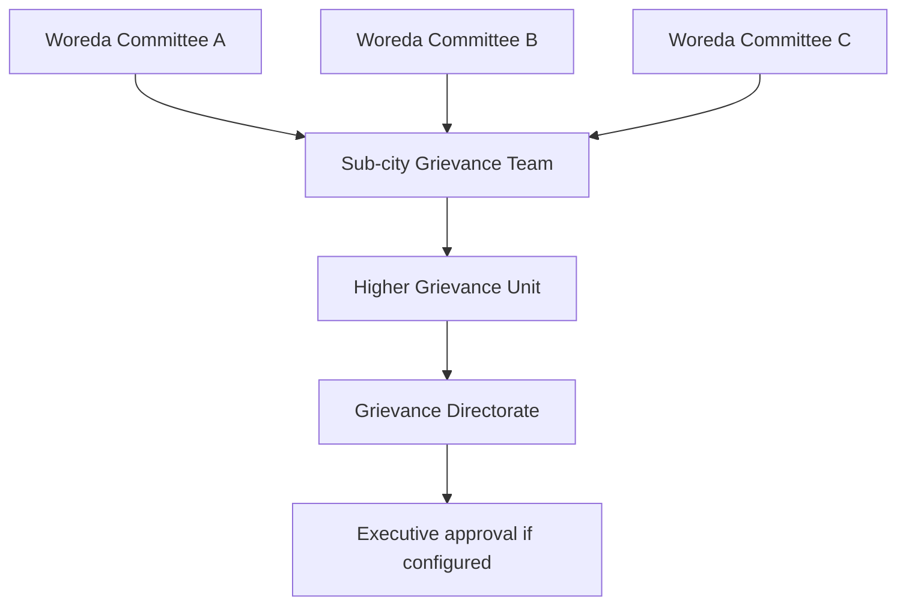

# Grievance routing

`GrievanceRoutingService` selects effective, active, approved `GrievanceRoute` rows. Administrative ancestry does not itself authorize escalation. Each movement records a new `GrievanceCaseStage` and ends the previous stage with a movement-specific status.

## Configuration

Routes contain source and target handler type/ID, movement type, optional category and SLA profile, priority, effective dates, descendant applicability and approval metadata. Handlers are organizations, committees, organization units or external authorities; destinations are validated through `GrievanceHandlerRegistry`. Route editing clears its approval, so the changed route must be approved again. Controller approval enforces a different creator/approver except the existing super-admin exception.

Initial assignment searches the originating organization and eligible ancestor routes with `include_descendants`. Category-specific routes precede generic routes, then source specificity and numeric priority. If no usable route exists, exactly one available grievance committee in the originating organization can be selected as the local fallback. Ambiguous or unavailable choices leave routing unresolved.

Later movement starts from the current handler. Employee appeal and manual escalation fall back to the configured timeout-escalation route when no specific route exists. They do not invent a route from the organization hierarchy. Cross-organization movement is explicit and the new stage records the target organization's placement. Existing stages preserve the route and SLA used at movement time.

## Example only

These are conceptual examples, not universal production seed records. The teams/directorate are existing organization units. Each edge needs its own movement configuration and approval; each handling level needs an appropriate SLA.

Automatic movement locks and rechecks the case/stage; a unique `from_stage_id` prevents two successor stages. Missing routes create a blocked-escalation event instead of silently choosing an unrelated body. Operators must correct configuration and let the scheduled sweep retry.

## NEEDS_DECISION

Confirm the actual jurisdiction graph, whether local committee fallback is authorized, whether appeals may reuse timeout routes, external-authority permissions and organizational coverage, and whether super-admin route self-approval is acceptable. Configuration examples cannot establish those policy decisions.
