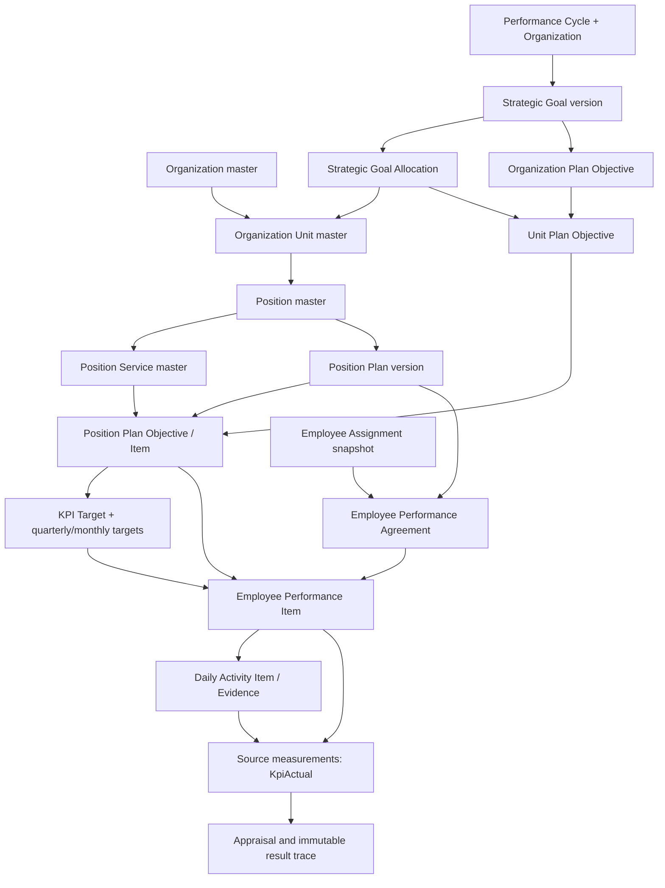

# Performance cascade

## Source audit before implementation

The existing master-data graph is `Organization → OrganizationUnit → Position → PositionService`.
Neither `positions` nor `position_services` has a `strategic_goal_id` field in the migrations, models, requests, or UI. There is no direct legacy master-data goal mapping to remove.

The existing planning graph is `PerformanceCycle + Organization → StrategicGoal → StrategicGoalAllocation → OrganizationUnit`, alongside `PerformancePlan(ORGANIZATION → UNIT → POSITION) → PerformanceObjective → KpiTarget → KpiPeriodTarget`. `PerformanceObjective.parent_objective_id` and `PerformanceCascade` record upstream lineage. Unit and position plans already exist as types of `performance_plans`; objectives and targets are their items. They must be reused.

The employee graph is `EmployeeAssignment → EmployeePerformanceAgreement.performance_plan_id → EmployeePerformanceItem.position_target_id → KpiTarget`. Agreements retain assignment, organization, unit, position, and plan context. `DailyActivityItem.employee_performance_item_id` links evidence/progress to an agreement item. `KpiActual` and `PerformanceResult.snapshot_json` keep measured results and appraisal calculation traces.

Issues identified:

- Planning objectives do not reference position services or unit goal allocations.
- Goal readiness sums linked objectives at every level, which can double-count cascades and parallel plan versions.
- Allocation writes allow totals above the goal until readiness validation.
- Unitless positions can bypass unit plans; plan authorization stops at organization scope.
- Target amendments repoint existing employee items and child targets, changing historical context.
- Plan version copies omit quarterly/monthly target rows.
- Strategic goals have no amendment/version dimension.

The existing methodology in `docs/epms-strategic-planning.md` requires exactly one lead allocation; this is preserved, not introduced as a government policy.

## Final relationship architecture

Organization, unit and position plans remain `performance_plans` types. Their items remain `performance_objectives`; no duplicate unit-plan, position-plan, or position-plan-item tables were created. A local objective may remain operational and unlinked to strategy. When an objective contributes to a strategic goal, its annual lineage goes through the exact published parent objective and an allocated unit (or its allocated ancestor).

### Schema and compatibility

The additive migration `2026_10_04_100000_link_performance_items_to_allocations_and_services.php` adds:

| Existing table | Added fields | Purpose |
|---|---|---|
| `performance_objectives` | nullable `strategic_goal_allocation_id`, nullable `position_service_id` | Annual responsibility and reusable master service links; restricted foreign keys and lookup indexes |
| `strategic_goals` | `version_no` default 1, nullable `supersedes_goal_id`, nullable `change_reason` | Audited amendments without overwriting published goal data |

The unique goal key becomes `(cycle_id, organization_id, code, version_no)`. All existing goals remain version 1. No position or service master receives a goal FK. Existing parent/source objective fields, cascade records, agreement snapshots, decimal fields, targets, evidence, actuals and result snapshots are retained. Nullable link fields deliberately leave older unmapped rows untouched; there is no guessed data backfill.

Rollback is possible before the new fields have operational history. The migration refuses rollback when goal versions beyond 1 or new objective links exist. If any new objective links have been populated, export and preserve them before rollback; the old application cannot represent them. Never use rollback to collapse amendments or erase history.

### Allocation and weight semantics

| Value | Basis and invariant |
|---|---|
| Goal `weight_percent` | Absolute organization percentage points; the selected strategic basis totals exactly 100 before review/approval/publication |
| Allocation `organization_contribution_percent` | Absolute share of that goal; every share is positive, draft sum may be below the goal, never above it; publication sum equals the goal weight |
| Organization objective `absolute_weight_percent` | Goal-linked organization objective shares equal their goal weight; only objectives of the applicable root plan count |
| Objective `weight` / `local_weight_percent` | Local normalized plan weights, total 100; both fields must agree when supplied |
| Target weight | Normalized within its objective, total 100 |
| Employee item weight | Adapted plan objective ? target weight / 100, normalized across the agreement; separate from absolute strategic allocation |

Example: an organization goal weighs 30%, allocated 15% to Planning, 10% to HR and 5% to Finance. Planning's own objectives can still total 100% locally. A Planning achievement of 90% contributes `15 ? 90 / 100 = 13.5000` organization percentage points. It does not imply that every Planning employee has an appraisal weight of 15%.

Calculations use existing DECIMAL columns and Brick Math BigDecimal operations. Organization performance consumes KPI quantities through declared aggregation rules; employee appraisal scores are never summed into the organization. Percentage aggregation uses numerator/denominator totals where configured; non-combinable measures require their own measurement. See [PostgreSQL exact numeric types](https://www.postgresql.org/docs/17/datatype-numeric.html).

### Version and historical rules

1. Published goals and plans are edited through reason-required draft successors. Published predecessor data, allocations and employee references remain attached to their original IDs.
2. A goal amendment copies allocations under the new goal ID. Its code is immutable so the strategic version family remains identifiable. A pending successor prevents another concurrent amendment.
3. An organization plan amendment retains its goal basis until the drafter explicitly selects amended goals. Readiness checks use that plan's own strategic references, rather than all descendant objectives or all concurrent versions.
4. When a child plan is amended after its parent has changed, the user explicitly selects the published parent version. Objective mapping follows `source_objective_id` ancestry. KPI target mapping requires one current target for the mapped objective and KPI. Missing or ambiguous successors produce `NEEDS_DECISION` and the transaction rolls back; matching names or codes are not treated as proof.
5. New plan and target versions copy quarter/month target rows. Target amendments preserve older employee-item and child-target foreign keys. Scoring and roll-up traverse predecessor measurements without rewriting those references.
6. Daily resynchronization may include predecessor tasks. For the same exact period, the newest item measurement replaces the older measurement logically; both rows remain stored. Distinct reporting periods retain their own measurements.
7. Position moves do not rewrite plan unit snapshots. Existing service references remain readable after deactivation; newly selected services must be active and belong to the plan position and organization. Referenced service master records cannot be moved or deleted.
8. Finalized/released result snapshots remain immutable. New working calculations do not rewrite historical snapshots.

### Assignments, transfers and evidence

Normal agreement creation requires the employee's active primary assignment, matching `current_assignment_id`. The published position plan must match the agreement's cycle, organization, unit and position snapshot and overlap its dates. Temporary acting assignments retain the existing explicit workflow.

Completing an HR transfer now closes old agreed/active/under-review agreements inside the same transaction, at the earlier of their existing end date and the day before the new assignment begins. Old plan, service, objective, target, actual, evidence and result links remain intact. A transfer that would create a negative agreement period is refused and rolled back for an explicit decision. Finalized result snapshots are preserved.

A receiving-organization agreement is created through its authorized cycle/plan workflow. The transfer does not guess a receiving cycle or fabricate a replacement plan. This matters for transfers between organizations whose performance cycles differ.

Daily evidence must belong to the same employee, assignment and agreement period. If an item is selected, the daily task must point to that item; cross-agreement/cross-item links are refused. DAILY_ACTIVITY synchronization uses approved quantities (or the existing configured submission policy), supports SUM, and excludes unlinked or wrong-assignment work. No eligible measurement returns null; a deliberately recorded zero remains zero. Activity counts alone never produce a score.

`PerformanceCascadeService` centralizes goal resolution, allocation derivation, historical traces, goal cascade queries and decimal contribution calculation. Plan and agreement pages display the trace; daily activity presentation exposes the same reverse trace for linked tasks. Unlinked operational work remains unlinked rather than being attributed to a guessed goal. Eager organization/cycle graph loads are cached within a service instance, including batched employee visibility for goal drilldowns.

### Authorization and UI

Mutation authority combines the named permission, organization scope and explicit unit reviewer coverage; scoped organizational approval authority retains oversight. Titles such as HR Officer do not grant planning rights. Cross-unit managers and employees without coverage cannot mutate another unit's planning, targets, schedules or actuals. Employee names in cascades use the same agreement visibility policy as agreement lists, including management permission for named managers.

The UI now provides:

- Position detail sections for services, current published plan and other/historical plans, retaining recorded organization/unit/cycle/version/dates and separately checking historical organization access.
- Position plan item service and upstream-objective selection, local weights, and expandable strategic lineage.
- Goal version/amendment history, allocation unit-plan statuses and read-only goal ? unit ? position ? service ? KPI ? authorized employee drilldowns.
- Explicit published upstream version selection for child amendments, with ambiguity handled as a decision rather than a silent rewrite.
- Read-only item lineage in agreement and daily activity views. Labels are supplied in English and Amharic.

### Live local audit and data decisions

The read-only PostgreSQL audit before applying the additive migration found 3 goals and zero allocations, plans, objectives, services, agreements, agreement items and daily activity items. Neither position nor service master contained a goal field. One active position had no unit. Its proper unit is `NEEDS_DECISION`; no placement was guessed. The application now requires unit placement before creating a position plan.

Only the new additive EPMS migration was applied to the local database. No live goals or mappings were rewritten, no master records were moved, and demo seeders were not run against the live database.

The repository also has a pre-existing pending `2026_09_29_100000_register_court_case_permissions` migration. A full `migrate --pretend` encounters its PostgreSQL insertGetId dry-run error before EPMS. The EPMS migration's separate PostgreSQL preview succeeded and its local execution succeeded. The unrelated migration remains pending.

### Demo fixture

`DemoPerformanceSeeder` now builds an isolated complete example using the existing demo organization, Planning unit, position and assigned employee. Root objectives weigh 30/40/30; the shared 30% goal has 15/10/5 allocations. Published organization, unit and position plans use existing tables. Two local position items reuse one service, each weighing 50%, with KPI target weights of 100. A draft employee agreement and measurable draft daily task demonstrate traceability without creating an official actual or appraisal score. A repeat seed preserves existing versions and avoids duplicate plans.

### Verification

Focused regressions cover allocation limits, readiness excluding descendants, goal amendment history, unit authority, service scope and reuse, unitless positions, historical plan snapshots, period-target copies, assignment selection, immutable target links, daily evidence context, amendment measurement deduplication and transfer closure. Final run totals are recorded below after completion.

### Requested handoff checklist

| # | Handoff item | Result |
|---|---|---|
| 1 | Current Strategic Goal relationship | Cycle + organization ? goal ? unit allocation; root objectives reference the goal |
| 2 | Current Position relationship | Organization + unit master; plans own annual position snapshots |
| 3 | Current Position Service relationship | Reusable responsibility/service master belonging to a position |
| 4 | Problems found | Allocation overflow, readiness double-counting, missing service links, unitless bypass, weak unit authority, history rewrites, missing period copies/versioning and transfer boundary gap |
| 5 | Direct goal FK usages | Existing goal allocations and performance objectives; none on positions/services |
| 6 | Final architecture | Diagram and version/trace rules above |
| 7 | Tables reused | Goals, allocations, plans, objectives, cascades, KPIs/targets/period targets, assignments, agreements/items, daily items/evidence, actuals/contributions/results |
| 8 | Added columns | Two nullable objective links and three goal amendment fields; no duplicate planning tables |
| 9 | Legacy retained/removed | Existing fields retained; no master goal field existed to remove |
| 10 | Data migration | Existing goals default version 1; no guessed link backfill |
| 11 | NEEDS_DECISION | One live unitless active position; unresolved upstream successor mappings are explicitly refused |
| 12 | Allocation rules | Positive absolute shares, never over goal, exact total plus existing one-lead rule at publication |
| 13 | Unit plan | Existing UNIT plan and objective items linked through allocated responsibility |
| 14 | Position plan | Existing POSITION plan beneath its unit plan, retaining annual snapshots |
| 15 | Service | Optional per-item reusable master reference, scoped and history-safe |
| 16 | Agreement | Exact active assignment and published applicable position plan |
| 17 | Daily trace | Daily task ? agreement item ? position objective/service ? upstream unit objective/allocation ? goal |
| 18 | Weights | Absolute allocation and local normalized weights remain mathematically separate |
| 19 | UI | Position sections, service/upstream selectors, version history, allocation statuses and cascade traces |
| 20 | Authorization | Permission + organization + unit coverage, safe employee visibility |
| 21 | Seeds | Complete isolated repeat-safe demo; no live seeding |
| 22 | Tests | New domain/history/security/demo regressions plus existing workflows |
| 23 | Test/build results | Final totals and limitations follow |

